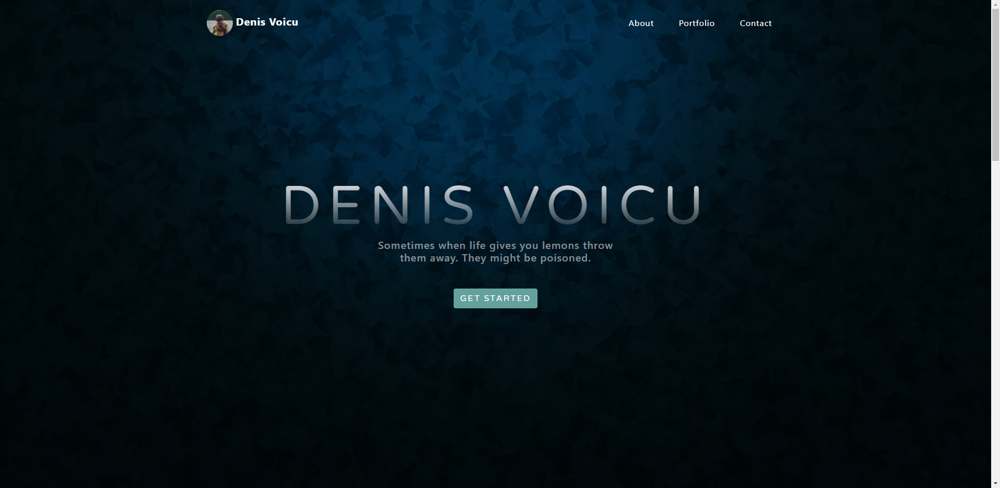

# Portfolio template

In this project I created a portfolio template while learning [Bootstrap](https://getbootstrap.com/) framework.
The template is finished and the next step was to import it to Wordress and make it easier to add, remove and change information. 
Meanwhile, I had another for my portoflio so this project remains as it is.
